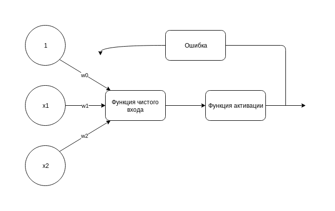

# perceptron-binlogic

Попытка создать простой персептрон для базовых бинарных логических функций (разумеется, кроме xor)



## Зависимости
Отсутствуют, использованы только функции стандартной библиотеки

## Пример работы программы для функции and

```bash
python3 perceptron.py
Weights: [-0.06, 0.04, 0.02]
Errors: [2, 3, 3, 2, 1, 0, 0, 0, 0, 0]
```

## Разбор алгоритма по частям на примере функции add

Из примера выше видно, что алгоритм сходится на шестой эпохе, поэтому
я рассмотрю здесь только эти шесть эпох, предполагая, что больше
изменений не будет.

На вход мы подаём 4 набора образов, каждый представляет собой 2-мерный
вектор:

```python3
X = [[0, 0], [0, 1], [1, 0], [1, 1]]
```
Соответствующие верные значения:
```python3
y = [-1, -1, -1, 1]
```
Алгоритм построен таким образом, что различает только два класса
ответов, при этом их значения -1 и 1 имеют важное значение для определения
дельты веса на каждой итерации. Поэтому в данном пример -1 соответствует
нулю, а 1 -- единице.

Всего будет 6 * 4 = 24 итераций. Если предсказанное значение ~y
соответствует ожидаемому, то дельта будет равна нулю, и изменений в
весах не случится. Для таких случае я буду сразу переходить к следующей
итерации.

Начнём с генерации весового вектора: w = [0, 0, 0] для вектора
X = [1, x1, x2]

### Эпоха 1

1.1: x1=0, x2=0, y=-1

0 + 0 * 0 + 0 * 0 = 0 => ~y = 1 -- неверный ответ, значит дельта не ноль

d = n * (y - ~y) = 0.01 * (-1-1) = -0.02

Корректируем веса:

w0 = w0 + d = -0.02
w1 = w1 + d * x1 = 0 - 0.02 * 0 = 0
w2 = w2 + d * x2 = 0 - 0.02 * 0 = 0

Получили новый весовой вектор: w = [-0.02, 0, 0]

1.2: x1=0, x2=1, y=-1

-0.02 + 0 * 0 + 0 * 1 = -0.02 => ~y = -1 -- верно, дельта ноль

1.3: x1=1, x2=0, y = -1

-0.02 + 0 * 1 + 0 * 0 = -0.02 => ~y = -1 -- верно, дельта ноль

1.4: x1=1, x2=1, y=1

-0.02 + 0 * 1 + 0 * 1 = -0.02 => ~y = -1 -- неверно

d = n * (y - ~y) = 0.01 * (1 - (-1)) = 0.02

w0 = w0 + d = -0.02 + 0.02 = 0
w1 = w1 + d * x1 = 0 + 0.02 = 0.02
w2 = w2 + d * x2 = 0 + 0.02 = 0.02

Получаем новый вектор весов: w = [0, 0.02, 0.02]

Всего за эпоху встретили две ошибки

### Эпоха 2

2.1 x1=0, x2=0, y=-1

0 + 0.02 * 0 + 0.02 * 0 = 0 => ~y = 1 -- неверно

d = n * (y - ~y) = 0.01 * (-1 - 1) = -0.02

w0 = w0 + d = 0 - 0.02 = -0.02
w1 = w1 + d * x1 = 0.02 - 0.02 * 0 = 0.02
w2 = w2 + d * x2 = 0.02 - 0.02 * 0 = 0.02

Новый весовой вектор: [-0.02, 0.02, 0.02]

2.2 x1=0, x2=1, y=-1

-0.02 + 0.02 * 0 + 0.02 * 1 = 0 => ~y = 1 -- неверно

d = n * (y - ~y) = 0.01 * (-1 - 1) = -0.02

w0 = w0 + d = -0.02 - 0.02 = -0.04
w1 = w1 + d * x1 = 0.02 - 0.02 * 0 = 0.02
w2 = w2 + d * x2 = 0.02 - 0.02 * 1 = 0

Новые веса: [-0.04, 0.02, 0]

2.3 x1=1, x2=0, y=-1

-0.04 + 0.02 * 1 + 0.02 * 0 = -0.02 => ~y = -1 -- верно

2.4 x1=1, x2=1, y=1

-0.04 + 0.02 * 1 + 0 * 1 = -0.02 => ~y = -1 -- неверно

d = n * (y - ~y) = 0.01 * (1 - (-1)) = 0.02

w0 = w0 + d = -0.04 + 0.02 = -0.02
w1 = w1 + d * x1 = 0.02 + 0.02 * 1 = 0.04
w2 = w2 + d * x2 = 0 + 0.02 * 1 = 0.02

Новые веса: [-0.02, 0.04, 0.02]

За эпоху встретили три ошибки

### Эпоха 3

3.1 x1=0, x2=0, y=-1

-0.02 + 0.04 * 0 + 0.02 * 0 = -0.02 => ~y = -1 -- верно

3.2 x1=0, x2=1, y=-1

-0.02 + 0.04 * 0 + 0.02 * 1 = 0 => ~y = 1 -- неверно

d = n * (y - ~y) = 0.01 * (-1 - 1) = -0.02

w0 = w0 + d = -0.02 - 0.02 = -0.04
w1 = w1 + d * x1 = 0.04 - 0.02 * 0 = 0.04
w2 = w2 + d * x2 = 0.02 - 0.02 * 1 = 0

Новые веса: [-0.04, 0.04, 0]

3.3 x1=1, x2=0, y=-1

-0.04 + 0.04 * 1 + 0 * 0 = 0 => ~y = 1 -- неверно

d = n * (y - ~y) = 0.01 * (-1 - 1) = -0.02

w0 = w0 + d = -0.04 - 0.02 = -0.06
w1 = w1 + d * x1 = 0.04 - 0.02 * 1 = 0.02
w2 = w2 + d * x2 = 0 - 0.02 * 0 = 0

Новые веса: [-0.06, 0.02, 0]

3.4 x1=1, x2=1, y=1

-0.06 + 0.02 * 1 + 0 * 1 = -0.04 => ~y = -1 -- неверно

d = n * (y - ~y) = 0.01 * (1 - (-1)) = 0.02

w0 = w0 + d = -0.06 + 0.02 = -0.04
w1 = w1 + d * x1 = 0.02 + 0.02 * 1 = 0.04
w2 = w2 + d * x2 = 0 + 0.02 * 1 = 0.02

Новые веса: [-0.04, 0.04, 0.02]

Всего 3 ошибки за эпоху

### Эпоха 4

4.1 x1=0, x2=0, y=-1

-0.04 + 0.04 * 0 + 0.02 * 0 = -0.04 => ~y = -1 -- верно

4.2 x1=0, x2=1, y=-1

-0.04 + 0.04 * 0 + 0.02 * 1 = -0.02 => ~y = -1 -- верно

4.3 x1=1, x2=0, y=-1

-0.04 + 0.04 * 1 + 0.02 * 0 = 0 => ~y = 1 -- неверно

d = n * (y - ~y) = 0.01 * (-1 - 1) = -0.02

w0 = w0 + d = -0.04 - 0.02 = -0.06
w1 = w1 + d * x1 = 0.04 - 0.02 * 1 = 0.02
w2 = w2 + d * x2 = 0.02 -0.02 * 0 = 0.02

Новые веса: [-0.06, 0.02, 0.02]

4.4 x1=1, x2=1, y=1

-0.06 + 0.02 * 1 + 0.02 * 1 = -0.02 => ~y = -1 -- неверно

d = n * (y - ~y) = 0.01 * (1 - (-1)) = 0.02

w0 = w0 + d = -0.06 + 0.02 = -0.04
w1 = w1 + d * x1 = 0.02 + 0.02 * 1 = 0.04
w2 = w2 + d * x2 = 0.02 + 0.02 * 1 = 0.04

Новые веса: [-0.04, 0.04, 0.04]

Всего 2 ошибки за эпоху

### Эпоха 5

5.1 x1=0, x2=0, y=-1

-0.04 + 0.04 * 0 + 0.04 * 0 = -0.04 => ~y = -1 -- верно

5.2 x1=0, x2=1, y=-1

-0.04 + 0.04 * 0 + 0.04 * 1 = 0 => ~y = 1 -- неверно

d = n * (y - ~n) = 0.01 * (-1 - 1) = -0.02

w0 = w0 + d = -0.04 - 0.02 = -0.06
w1 = w1 + d * x1 = 0.04 - 0.02 * 0 = 0.04
w2 = w2 + d * x2 = 0.04 - 0.02 * 1 = 0.02

Новые веса: [-0.06, 0.04, 0.02]

5.3 x1=1, x2=0, y=-1

-0.06 + 0.04 * 1 + 0.02 * 0 = -0.02 => ~y = -1 -- верно

5.4 x1=1, x2=1, y=1

-0.06 + 0.04 * 1 + 0.02 * 1 = 0 => ~y = 1 -- верно

Всего 1 ошибка за эпоху

### Эпоха 6

6.1 x1=0, x2=0, y=-1

-0.06 + 0.04 * 0 + 0.02 * 0 = -0.06 => ~y = -1 -- верно

6.2 x1=0, x2=1, y=-1

-0.06 + 0.04 * 0 + 0.02 * 1 = -0.04 => ~y = -1 -- верно

6.3 x1=1, x2=0. y=-1

-0.06 + 0.04 * 1 + 0.02 * 0 = -0.02 => ~y = -1 -- верно

6.4 x1=1. x2=1. y=1

-0.06 + 0.04 * 1 + 0.02 * 1 = 0 => ~y = 1 -- верно

Ошибок нет, алгоритм сошёлся.
